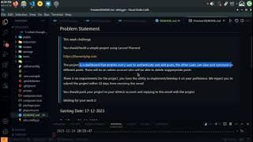

# BBlogger

A case study & a great challenge for me to assess my learning speed 💪

## Deployed Page [Soon]

## Problem Statement

> Welcome, thank you for contacting us and we are happy for being a part of \_\_\_\_\_ Team in Training Program
>
> To proceed further with the Internship, you should build a simple project using Laravel Filament
>
> https://filamentphp.com
>
> The project is a dashboard that enables every user to authenticate and add posts, the other users can view and comment on different posts. There will be an admin account who will be able to delete inappropriate posts
>
> There is no requirements for the project, you have the ability to implement/deevlop it on your preference. We expect you to submit the project within 10 days from receiving this email
>
> You should push your project to your GitHub account and replying to this email with the project
>
> Waiting for your work 🔥

### Satrting Date: 17-12-2023

### End Date: 23-12-2023

## Admin Login

Use the following credentials to login as an admin

-   Email: rashed@filament.com
-   Password: Aa1234567

## User Login

Use the following credentials to login as a normal user

-   Email: sleem@filament.com
-   Password: Aa1234567

## Project Explaination [Engish]

<iframe width="560" height="315" src="https://www.youtube.com/embed/Fz5fBwnzlPA?si=7lbnngUVZBcECrLx" title="YouTube video player" frameborder="0" allow="accelerometer; autoplay; clipboard-write; encrypted-media; gyroscope; picture-in-picture; web-share" allowfullscreen></iframe>
